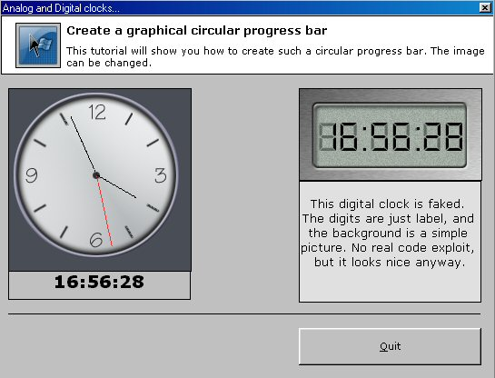



## CircAnaDig Clock \(Circular Analog and digital clocks\)

### Description

I saw recently there was a buzz concerning digital clocks. I decided to provide two different types of clocks. One fake digital (but nice looking, in my opinion), so don't expect coding exploits, and a circular analog clock. This one is a bit tricky, and the code is commented. A good base to start when willing to generate cosine and sine tables (ie: can be usefull if you want to code 3D apps). This code could have been set in intermediate, but due to some tricky routines... well you see. Nothing mind blasting but a funny couple of hours to bring those to life.
 
### More Info
 

             |
---                |---
**Submitted On**   |1999-02-01 10:07:04
**By**             |[brainwasher](https://github.com/Planet-Source-Code/PSCIndex/blob/master/ByAuthor/brainwasher.md)
**Level**          |Advanced
**User Rating**    |4.5 (27 globes from 6 users)
**Compatibility**  |VB 6\.0
**Category**       |[Miscellaneous](https://github.com/Planet-Source-Code/PSCIndex/blob/master/ByCategory/miscellaneous__1-1.md)
**World**          |[Visual Basic](https://github.com/Planet-Source-Code/PSCIndex/blob/master/ByWorld/visual-basic.md)
**Archive File**   |[CircAnaDig1842871222005\.zip](https://github.com/Planet-Source-Code/brainwasher-circanadig-clock-circular-analog-and-digital-clocks__1-58439/archive/master.zip)

